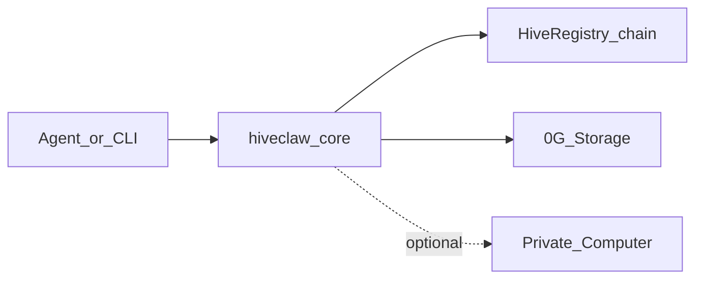

# Concepts

## Hive memory lanes

Logical keys are grouped into:

- **`shared/…`** — visible to the hive membership policy on chain; ciphertext is still encrypted with the **hive symmetric key** before upload.
- **`private/<agent-address>/…`** — namespaced to an agent wallet; same encryption model, different path convention.

Path helpers and normalization live in **`hiveclaw-core`** (`memory-paths`, `putHiveMemory`, `getHiveMemory`).

## Encryption and storage

1. Plaintext is encrypted with the per-hive symmetric key (`HIVECLAW_HIVE_KEY_HEX` or `HIVECLAW_HIVE_KEYS_JSON`).
2. Ciphertext is uploaded to **0G Storage**; pointers and content hashes are committed via **HiveRegistry** so provenance is on-chain.

## Private Computer

Optional **Private Computer** (OpenAI-compatible) summarizes recalled segments — used by CLI `summarize` / `reflect` and plugin tools `summarize_memory` / `hiveclaw_reflect`. Configure `HIVECLAW_PRIVATE_COMPUTER_URL` and optional API key.

## Flow (high level)

## Library surface

For programmatic use, see exports from **`hiveclaw-core`** (config load, registry calls, `putHiveMemory` / `getHiveMemory`, `summarizeMemories`, `reflectAndCommitShared`, crypto helpers). The CLI and OpenClaw plugin are thin wrappers over these APIs.
